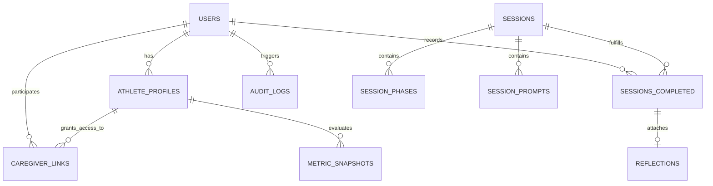

# Fearless Footballer — Relational Data Models & Schema

**Database Engine:** PostgreSQL 16+  
**ORM Support:** Prisma / Drizzle ORM  
**Phase 0 scope:** The beta data model is one athlete linked to one active parent/guardian caregiver, one published interactive session package, private athlete reflections, and idempotent offline completion events. `docs/BETA_SCOPE.md` remains the release-scope authority; broader catalog and relationship models are post-beta.  

---

## 1. Entity-Relationship Diagram



---

## 2. Core Schema Definition (Prisma Format)

```prisma
datasource db {
  provider = "postgresql"
  url      = env("DATABASE_URL")
}

generator client {
  provider = "prisma-client-js"
}

enum UserRole {
  ATHLETE
  CAREGIVER
  MENTOR_ADMIN
}

enum LinkStatus {
  PENDING
  ACTIVE
  REVOKED
}

enum MindsetCategory {
  CALM
  FOCUS
  CONFIDENCE
  RESILIENCE
  PERFORMANCE
}

enum SessionMode {
  INTERACTIVE
  GUIDANCE
  RELAXATION
}

enum ReflectionFeeling {
  CLEARER
  STEADIER
  MORE_READY
}

model User {
  id                String             @id @default(cuid())
  email             String             @unique
  passwordHash      String
  role              UserRole           @default(ATHLETE)
  fullName          String
  birthDate         DateTime?
  timezone          String             @default("UTC")
  createdAt         DateTime           @default(now())
  updatedAt         DateTime           @updatedAt

  athleteProfile    AthleteProfile?
  caregiverLinks    CaregiverLink[]    @relation("CaregiverUser")
  completions       SessionCompleted[]
  auditLogs         AuditLog[]

  @@index([email])
}

model AthleteProfile {
  id                String             @id @default(cuid())
  userId            String             @unique
  user              User               @relation(fields: [userId], references: [id], onDelete: Cascade)
  
  targetMindset     MindsetCategory    @default(CALM)
  composureScore    Int                @default(70)
  currentStreak     Int                @default(0)
  bestStreak        Int                @default(0)
  lastSessionAt     DateTime?
  
  caregiverLinks    CaregiverLink[]    @relation("AthleteProfile")
  metricSnapshots   MetricSnapshot[]
  
  createdAt         DateTime           @default(now())
  updatedAt         DateTime           @updatedAt
}

model CaregiverLink {
  id                String             @id @default(cuid())
  athleteId         String
  athlete           AthleteProfile     @relation("AthleteProfile", fields: [athleteId], references: [id], onDelete: Cascade)
  
  caregiverUserId   String
  caregiverUser     User               @relation("CaregiverUser", fields: [caregiverUserId], references: [id], onDelete: Cascade)
  
  relationship      String             // Beta: "parent" | "guardian"
  status            LinkStatus         @default(PENDING)
  pairingCode       String?
  pairingExpiresAt  DateTime?
  athleteApprovedAt DateTime?

  coppaConsent      Boolean            @default(false)
  consentedAt       DateTime?
  revokedAt         DateTime?
  
  createdAt         DateTime           @default(now())
  updatedAt         DateTime           @updatedAt

  @@unique([athleteId, caregiverUserId])
  @@index([pairingCode])
}

model Session {
  id                String             @id @default(cuid())
  slug              String             @unique
  version           String             @default("1.0.0")
  title             String
  subtitle          String
  category          MindsetCategory
  defaultDuration   Int                // seconds, e.g. 300
  mentorName        String
  mentorTitle       String
  mentorAvatarUrl   String?
  heroImageUrl      String?
  isPublished       Boolean            @default(false)

  // Media URLs
  voiceStreamUrl    String
  musicBedUrl       String?
  captionsUrl       String?            // WebVTT format
  transcriptText    String             @db.Text

  phases            SessionPhase[]
  prompts           SessionPrompt[]
  completions       SessionCompleted[]

  createdAt         DateTime           @default(now())
  updatedAt         DateTime           @updatedAt

  @@index([category, isPublished])
}

model SessionPhase {
  id                String             @id @default(cuid())
  sessionId         String
  session           Session            @relation(fields: [sessionId], references: [id], onDelete: Cascade)
  phaseNumber       Int
  label             String             // "Center", "Reframe", "Rehearse"
  startSeconds      Int
  endSeconds        Int

  @@unique([sessionId, phaseNumber])
}

model SessionPrompt {
  id                String             @id @default(cuid())
  sessionId         String
  session           Session            @relation(fields: [sessionId], references: [id], onDelete: Cascade)
  timestampSeconds  Int
  promptText        String
  subText           String?

  @@index([sessionId, timestampSeconds])
}

model SessionCompleted {
  id                String             @id @default(cuid())
  userId            String
  user              User               @relation(fields: [userId], references: [id], onDelete: Cascade)
  sessionId         String
  session           Session            @relation(fields: [sessionId], references: [id], onDelete: Restrict)
  
  mode              SessionMode
  durationSeconds   Int
  completedAt       DateTime           @default(now())
  idempotencyKey    String             @unique

  reflection        Reflection?

  @@index([userId, completedAt])
}

model Reflection {
  id                String             @id @default(cuid())
  completionId      String             @unique
  completion        SessionCompleted   @relation(fields: [completionId], references: [id], onDelete: Cascade)
  
  feeling           ReflectionFeeling
  athleteNote       String?            @db.Text // Private to athlete ONLY!
  
  createdAt         DateTime           @default(now())
}

model MetricSnapshot {
  id                String             @id @default(cuid())
  athleteProfileId  String
  athleteProfile    AthleteProfile     @relation(fields: [athleteProfileId], references: [id], onDelete: Cascade)
  
  weekStartDate     DateTime
  composureScore    Int
  composureDelta    Int
  repsCompleted     Int
  streakDays        Int
  inferredMoodTrend String             // "Improving", "Steady", "Building"
  
  createdAt         DateTime           @default(now())

  @@index([athleteProfileId, weekStartDate])
}

model AuditLog {
  id                String             @id @default(cuid())
  userId            String?
  user              User?              @relation(fields: [userId], references: [id], onDelete: SetNull)
  action            String             // "LINK_CREATED", "ACCESS_REVOKED", "DATA_EXPORTED", "ACCOUNT_DELETED"
  entityType        String
  entityId          String
  ipAddress         String?
  userAgent         String?
  timestamp         DateTime           @default(now())

  @@index([userId, action])
}
```
