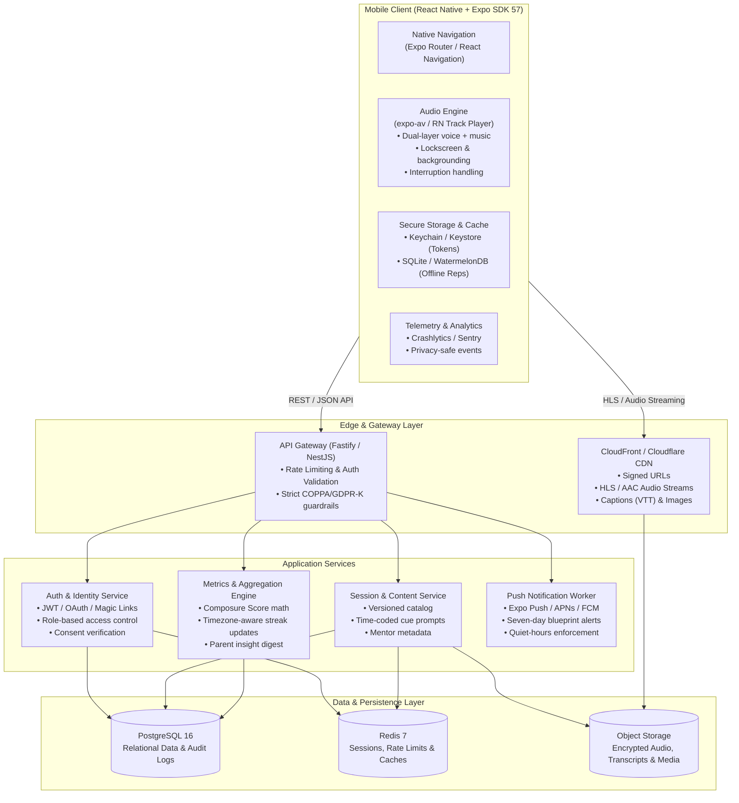

# Fearless Footballer — Mobile App Engineering Handoff & Architecture Blueprint

**Document Status:** Approved for Engineering Discovery  
**Target Release:** Beta v1.0 (Focused Athlete & Caregiver Experience)  
**Primary Platform:** Cross-platform Mobile (iOS & Android)  

---

## 1. Executive Summary & Product Vision

**Fearless Footballer** is a dedicated mental fitness, pre-match emotional regulation, and mindset conditioning platform built specifically for young competitive footballers (ages 10–18) and their caregivers. Unlike generic mindfulness applications, Fearless Footballer is grounded in modern sports psychology and competitive football matchday realities: handling crowd hostility, referee pressure, physical intimidation, penalty kicks, and post-error composure.

The current stage is a validated, interactive **mobile-first prototype**. This handoff records the longer-term architecture and design reference, while the Phase 0 scope contract in [`docs/BETA_SCOPE.md`](./BETA_SCOPE.md) is the authoritative source for the beta release.

### The Beta v1.0 Core Scope ("The Thin Vertical Slice")
Beta v1.0 is intentionally constrained to one testable mobile vertical slice:
- **1 Athlete Account** linked to **1 Parent/Guardian Account** through age gating, consent, pairing approval, and revocation.
- **Exactly one published session package:** *Nerves = Performance*, in interactive mode. Guidance and relaxation are post-beta options.
- **Native interactive playback** with phase progress, timed prompts, completion, and interruption/background handling.
- **Private completion and reflection**, deterministic composure/streak updates, and an idempotent offline completion queue.
- **A consented read-only caregiver dashboard** that exposes aggregate progress only and never transmits reflections, transcripts, audio, or playback controls.

The React/Vite application remains a visual and interaction reference. Its five-tab shell, hash navigation, browser audio engine, and hardcoded state are not beta architecture or release evidence. The executable screen contract is [`project_details/Phase 0 Mobile Wireframe Specification.md`](../project_details/Phase%200%20Mobile%20Wireframe%20Specification.md).

---

## 2. Target Technical Architecture

### 2.1 Mobile Application Foundation
- **Framework:** React Native with Expo (Managed Workflow, Prebuild compatible).
- **Navigation:** Expo Router or React Navigation v7 with typed route params.
- **Audio & Media Engine:** `react-native-track-player` or `expo-av` with native audio ducking, lockscreen transport controls, interruption handling (incoming calls, Siri/Google Assistant, Bluetooth disconnects), and background playback.
- **Secure Persistence:** `expo-secure-store` for authentication tokens; `expo-sqlite` or `@nozbe/watermelondb` for offline session caching and offline completion queuing.
- **State Management:** Zustand + TanStack Query (React Query) for optimistic updates and automatic network synchronization.

### 2.2 Backend & API Layer
- **Runtime:** Node.js (TypeScript) using NestJS or Fastify.
- **Database:** PostgreSQL with Prisma ORM or Drizzle.
- **Caching & Ephemeral State:** Redis for token revocation, pairing codes, and rate limiting.
- **Media Delivery:** AWS S3 + CloudFront CDN delivering dual-track audio (vocal stems at 128kbps AAC + stereo ambient beds at 192kbps AAC) along with WebVTT closed captions.

---

## 3. High-Fidelity UI Design & Screen System

The screens in this section are **design/reference concepts only** unless they are explicitly represented in `docs/BETA_SCOPE.md`. In particular, the five-tab HQ/Reps/Vault/Feed/Profile shell and the guidance/relaxation variants are not part of the Phase 0 implementation.

The mobile application design translates the sports-tech neon stadium aesthetic into mobile screens:

### 3.1 Onboarding: Matchday Mindset Selection (Design Image 3)
- **Header:** "FEARLESS" brand lockup with progress indicator ("2 of 5").
- **Question:** *"What do you want to feel before your next match?"*
- **Four Core State Cards:**
  1. **Calm:** *"Clear mind. Better decisions."* (Default recommended selection).
  2. **Sharp:** *"Focus. Faster reactions."*
  3. **Brave:** *"Face challenges. Play bolder."*
  4. **Unshakeable:** *"Stay strong. No matter what."*
- **Aesthetic:** High-contrast cyan neon selection border, glowing stadium pitch markings on the ground plane, floating particles, and a prominent bottom "Continue →" button.

### 3.2 Athlete HQ Dashboard (Design Images 2 & 4)
- **Header:** Time-contextual greeting (*"GOOD EVENING, Alex"*), stadium atmosphere backdrops, and notification bell.
- **Progression Metrics Header:**
  - **Composure Score Gauge:** Circular neon gauge with numerical score (e.g. `82`), dynamic tier rating, and info tooltip (*"Build your baseline"*).
  - **Current Streak Indicator:** Glowing magenta/cyan flame badge showing consecutive days (e.g. `4/5` or `0/1` baseline).
- **Today's Fearless Rep Card:**
  - Hero visual of athlete looking into stadium floodlights.
  - Title: *"Nerves = Performance"*, duration (*"5 min"*), category (*"Composure"*).
  - Call to action: *"Start rehearsal →"*.
- **Horizontal Shelf / Shortcuts:**
  1. **7-Day Blueprint:** *"Build composure, sharpen focus"* with weekly calendar selector (`MON`–`SUN`).
  2. **Mentor Spotlight:** *"Matthew McConaughey — The Power of Presence"*.
  3. **Recent Badge:** *"Focus Builder — Complete 3 reps in a row"*.
- **Mindset Pill Filter Bar:** Rapid filtering by *Calm*, *Focus*, *Confidence*, *Resilience*, *Performance*.
- **Bottom Navigation:** Fixed 5-tab bar (`HQ`, `Reps`, `Vault`, `Feed`, `Profile`).

### 3.3 Session Player (Design Image 1)
- **Header:** Back chevron, centered "FEARLESS" wordmark, Composure pill badge.
- **Mentor Identity:** Circular portrait of Alex Rivera (*Football Mentor*), session duration (*05:00*).
- **Three-Phase Progress Stepper:**
  - Step 1: **Center** (Arrive, somatic breathwork, heartbeat reduction).
  - Step 2: **Reframe** (Transform adrenaline into competitive information).
  - Step 3: **Rehearse** (Mental imagery of first pressure action on the pitch).
- **Central Playback Node:** Prominent circular play/pause button with pulsing radial neon gradient glow.
- **Scrubber Timeline:** 00:00 to 05:00 with draggable thumb and elapsed/remaining indicators.
- **Dynamic Prompt Callout:** Bold, center-stage rehearsal prompt (e.g. *"Notice the adrenaline. It is information."*).
- **Transport Bar:** -15s jump backward, Pause/Play toggle, +15s jump forward.
- **Audio Indicator:** Headphone recommendation badge and offline playback indicator.
- **Post-Session Trigger:** Bottom card previewing *"Finish strong — Reflect on what you learned"*.

### 3.4 Caregiver / Parent Dashboard
- **Strict Isolation:** Completely separated from player transport controls. Parents cannot play, seek, or overhear sessions.
- **Athlete Overview:** Athlete profile (*Alex Rivera*), active week indicator (*Matchday mindset · Week 1*), and linking status.
- **7-Day Rhythm:** Circular completion ring (e.g. `5/7 days`), dot status indicator for all 7 days.
- **Progress Patterns:**
  - *Mood Trend:* Qualitative progression (e.g. *"Improving — More settled after reps"*).
  - *Composure Trajectory:* Numerical score (`82`, `+8 this week`).
  - *Current Streak:* Active daily streak (`4 days`).
  - *Last Completed Rep:* Recency and duration (`5 min · Nerves = Performance`).
- **Supportive Conversation Starters:**
  - *"Try this tonight: 'What helped you reset today?' — Invite a story, not a score."*
  - *"Notice the effort: 'I noticed you made time for your rep.' — Reinforce consistency over outcome."*
  - *"Before matchday: 'Which cue do you want to carry with you?' — Help Alex choose their own anchor."*
- **Safeguarding & Privacy Notice:** Explicit disclosure: *"Private by design. This view shares progress patterns, not session transcripts or answers."*

---

## 4. Phase-by-Phase Implementation Roadmap

Phase 0 is a scope and foundation lock, not a commitment to build every screen in this handoff. The executable order is:

1. Reconcile `docs/BETA_SCOPE.md`, API contracts, and child-safety language.
2. Finish the Expo SDK 57 Router shell and secure local-state boundary.
3. Implement age gating, one-to-one consent/pairing, and account restrictions.
4. Deliver the single interactive session package and native playback behavior.
5. Add completion, private reflection, composure/streak updates, and offline sync.
6. Add the read-only caregiver dashboard and privacy authorization checks.
7. Complete accessibility, legal/privacy, hardening, device QA, TestFlight, and Play Internal Testing.

Guidance, relaxation, additional sessions, Mentor Feed, Vault, Map, social features, multiple caregivers, advanced personalization, and push notifications remain post-beta unless the beta test plan explicitly changes the scope.

---

## 5. Definition of Done for First Public Beta

A build is cleared for release on TestFlight and Google Play Internal Testing only when all criteria below pass:
1. **End-to-End Account Flow:** An athlete can register, complete the age gate, link one parent/guardian via pairing code, and explicitly approve or revoke caregiver access.
2. **Real Audio Playback:** Dual-track audio plays smoothly with screen locked, headphones unplugged/reconnected, incoming phone calls rejected/accepted, and backgrounding without memory leaks.
3. **Parent Dashboard Isolation:** Parent dashboard displays solely aggregated stats and conversation starters; zero session audio, transcripts, or answers are transmitted over the wire.
4. **Offline Capability:** A downloaded rep can be completed without active Wi-Fi or cellular service, with completion status queued and synced upon reconnection.
5. **Accessibility Validation:** WCAG 2.1 AA contrast verified; all interactive elements have 44x44pt touch targets; VoiceOver (iOS) and TalkBack (Android) announce navigation and player state correctly.
6. **Child Privacy & Legal Compliance:** Terms of Service, Privacy Policy, COPPA/GDPR-K parental consent records, and non-clinical health disclaimers are live and linked in-app.
